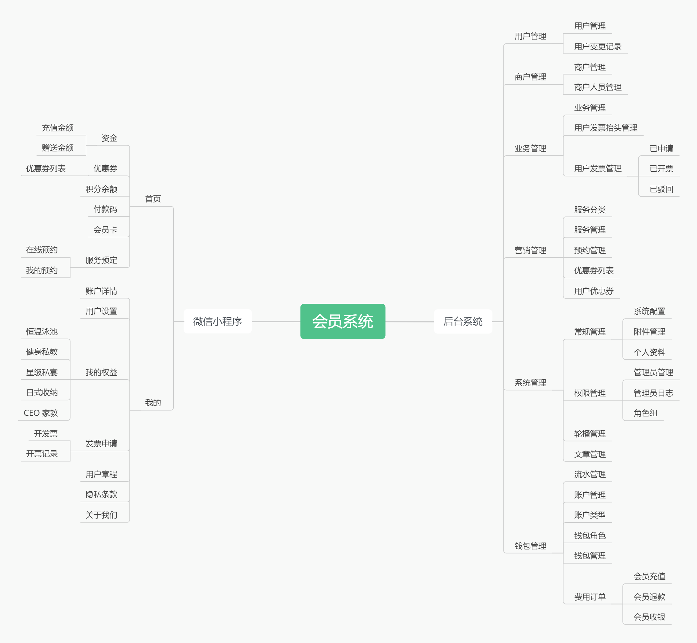
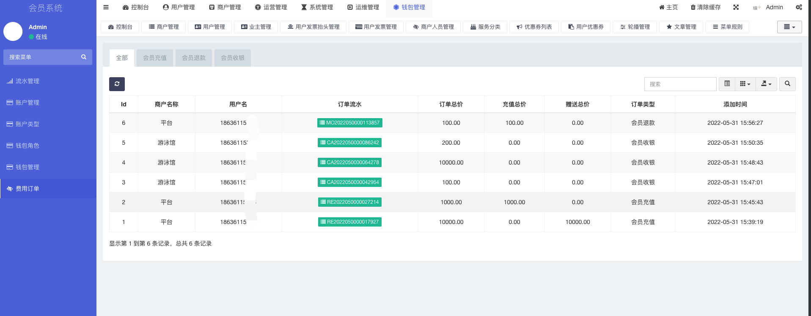
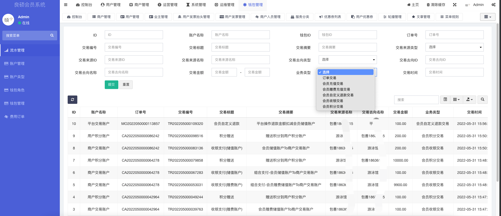
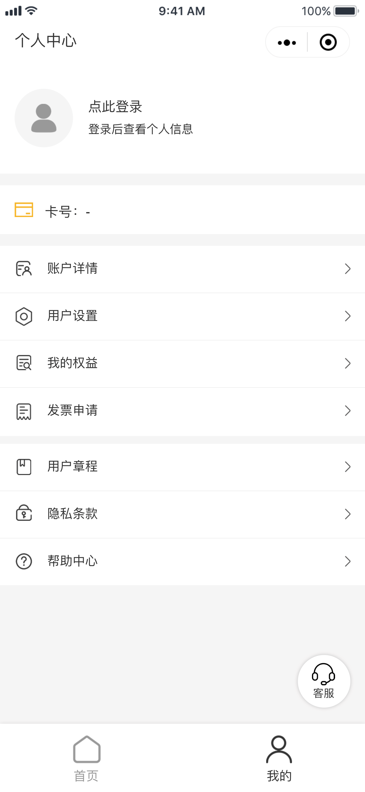
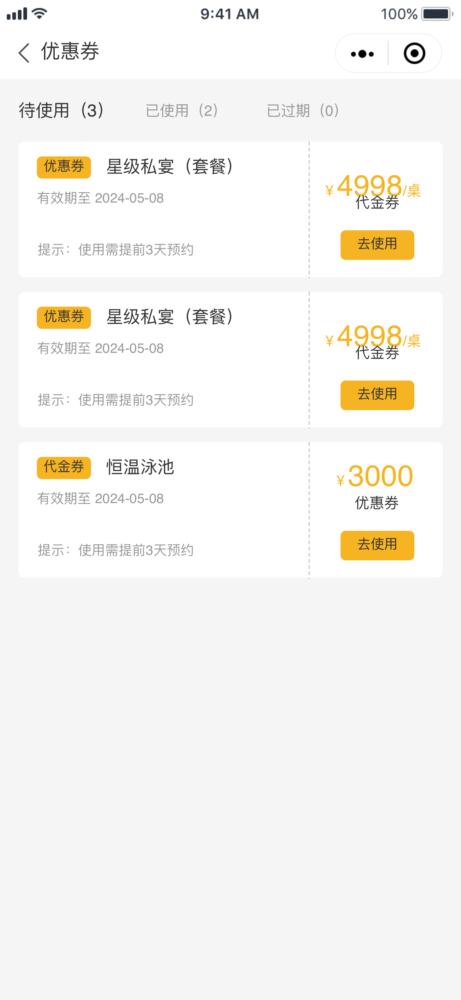

# 会员管理系统

#### 一、介绍
这个会员管理系统，目前是一个专门用于房地产的会员管理系统，也可用于其他行业！功能如下：
1. 代金券模块:	代金券按金额进行定额与扣减
1. 业主模块: 平台（房地产商）为了吸引会员（业主），为业主设置楼栋以及房屋，以及自动生成业主卡号
1. 储值卡模块: 	为业主储值卡充值功能，充值包括赠送金额和固定金额，注：赠送金额不可退，而固定金额是可以退款的（不进行微信支付管理）
1. 代金券模块: 	代金券按金额进行定额与扣减
1. 优惠券模块: 	优惠券按次数进行定价与扣减
1. VIP卡模块: 	指定卡类型（年、季、月）的不同服务
1. 动态码模块: 	业主享有会员卡动态二维码
1. 扫码核销模块: 	营业员可以扫动态码进行核销管理
1. 营业员模块: 	后台可以管理营业员，营业员开通后，可以在小程序上可以有入口，可以进行扫码核销管理
1. 营业员模块: 	后台可以管理营业员，营业员开通后，可以在小程序上可以有入口，可以进行扫码核销管理
1. 发票模块: 	业主可以选择指定消费商品，进行申请开具发票，发票规则等功能
1. 钱包财务模块: 	钱包账户类型（储值卡、优惠券、代金券、VIP卡）的充值、消费以退款，以及明细的记录、分析与根据日期进行统计
1. 客服模块: 	微信小程序客服模块
1. 文章管理: 	如用户章程、隐私条款、用户协议等文章进行管理
1. 系统管理模块: 	系统基本功能配置
1. 系统管理员及权限RBAC模块:	系统管理员的基本信息及权限划分
1. 统计模块:	控制台统计业主数量、优惠券数量、发票数量、核销数量等功能

#### 二、技术选型

1. HTML + CSS + JavaScript
2. 微信小程序原生开发
3. PHP7.4
4. MySQL5.7
5. Redis
6. Nginx
7. 等……

#### 三、实现功能

##### 后台功能

1. 用户管理
- 用户管理
- 用户变更管理

2. 商户管理
- 商户管理
- 商户人员管理

3. 业务管理
- 业务管理
- 用户发票抬头管理
- 用户发票管理

4. 营销管理
- 服务分类
- 服务管理
- 预约管理
- 优惠券列表
- 用户优惠券

5. 系统管理
- 常规管理
  - 系统配置
  - 附件管理
  - 个人资料
- 权限管理
  - 管理员管理
  - 管理员日志
  - 角色组
- 轮播管理
- 文章管理

6. 钱包管理
- 流水管理
- 账户管理
- 账户类型
- 钱包角色
- 钱包管理
- 费用订单
  - 会员充值
  - 会员退款
  - 会员收银

##### 小程序功能

1. 首页
- 资金
- 优惠券
- 积分余额
- 付款码
- 会员卡

2. 我的
- 账户详情
- 用户设置
- 我的权益
- 发票申请
- 用户章程
- 隐私条款
- 关于我们

#### 四、系统平台功能导图

##### 后台功能界面展示

##### 用户端小程序界面展示

需要的联系，低价出售，私信联系我！！

系统、游戏、运维、技术支持均可联系！！

